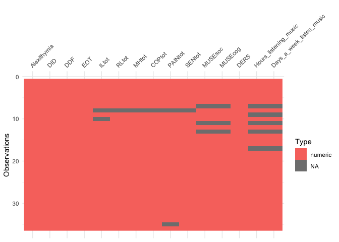
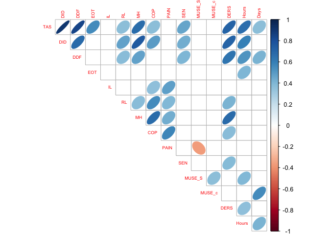
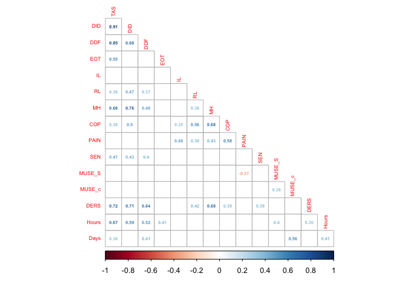

Data Analysis
================
Joel Larwood
30/04/2019

Data from clinical population to be reanalysed post stakeholder report.
Only relevant data has been retained and amde public from previous
deindetification script.

``` r
library(tidyverse)
library(knitr)
library(psych)
library(apa)
```

``` r
cs <- read_csv("CIID_PublicData.csv")
names(cs)
```

    ##  [1] "id"                       "emotionlexicon_1"        
    ##  [3] "emotionwords_1"           "TAS1_1"                  
    ##  [5] "TAS2_1"                   "TAS3_1"                  
    ##  [7] "TAS4_1"                   "TAS5_1"                  
    ##  [9] "TAS6_1"                   "TAS7_1"                  
    ## [11] "TAS8_1"                   "TAS9_1"                  
    ## [13] "TAS10_1"                  "TAS11_1"                 
    ## [15] "TAS12_1"                  "TAS13_1"                 
    ## [17] "TAS14_1"                  "TAS15_1"                 
    ## [19] "TAS16_1"                  "TAS17_1"                 
    ## [21] "TAS18_1"                  "TAS19_1"                 
    ## [23] "TAS20_1"                  "TAS4_1R"                 
    ## [25] "TAS5_1R"                  "TAS10_1R"                
    ## [27] "TAS18_1R"                 "TAS19_1R"                
    ## [29] "MUSE1_1"                  "MUSE2_1"                 
    ## [31] "MUSE3_1"                  "MUSE4_1"                 
    ## [33] "MUSE5_1"                  "MUSE6_1"                 
    ## [35] "MUSE7_1"                  "MUSE8_1"                 
    ## [37] "MUSE9_1"                  "MUSE10_1"                
    ## [39] "Aqol1_1"                  "Aqol2_1"                 
    ## [41] "Aqol3_1"                  "Aqol4_1"                 
    ## [43] "Aqol5_1"                  "Aqol6_1"                 
    ## [45] "Aqol7_1"                  "Aqol8_1"                 
    ## [47] "Aqol9_1"                  "Aqol10_1"                
    ## [49] "Aqol11_1"                 "Aqol12_1"                
    ## [51] "Aqol13_1"                 "Aqol14_1"                
    ## [53] "Aqol15_1"                 "Aqol16_1"                
    ## [55] "Aqol17_1"                 "Aqol18_1"                
    ## [57] "Aqol19_1"                 "Aqol20_1"                
    ## [59] "Aqol_IL_std_1"            "Aqol_Rel_std_1"          
    ## [61] "Aqol_MH_std_1"            "Aqol_Cope_std_1"         
    ## [63] "Aqol_Pain_std_1"          "Aqol_Sens_std_1"         
    ## [65] "Aqol_TOT_std_1"           "DERS6_1_1"               
    ## [67] "DERS6_4_1"                "DERS6_5_1"               
    ## [69] "DERS6_6_1"                "DERS5_total_1"           
    ## [71] "Hours_listening_music"    "Days_a_week_listen_music"
    ## [73] "Like_about_song_music"    "Song"

\#Missing data

``` r
missvar <- data.frame(nacount=colSums(is.na(cs)))
missvar$pctNA <- (missvar$nacount/(nrow(cs)))*100

missp <- data.frame(row.names = cs$id, nacount=rowSums(is.na(cs)))

missp$pctNA <- (missp$nacount/ncol(cs))*100

knitr::kable(missvar)
```

|                              | nacount |     pctNA |
| ---------------------------- | ------: | --------: |
| id                           |       0 |  0.000000 |
| emotionlexicon\_1            |       7 | 19.444444 |
| emotionwords\_1              |       9 | 25.000000 |
| TAS1\_1                      |       0 |  0.000000 |
| TAS2\_1                      |       0 |  0.000000 |
| TAS3\_1                      |       0 |  0.000000 |
| TAS4\_1                      |       0 |  0.000000 |
| TAS5\_1                      |       0 |  0.000000 |
| TAS6\_1                      |       0 |  0.000000 |
| TAS7\_1                      |       0 |  0.000000 |
| TAS8\_1                      |       0 |  0.000000 |
| TAS9\_1                      |       0 |  0.000000 |
| TAS10\_1                     |       0 |  0.000000 |
| TAS11\_1                     |       0 |  0.000000 |
| TAS12\_1                     |       0 |  0.000000 |
| TAS13\_1                     |       0 |  0.000000 |
| TAS14\_1                     |       0 |  0.000000 |
| TAS15\_1                     |       0 |  0.000000 |
| TAS16\_1                     |       0 |  0.000000 |
| TAS17\_1                     |       0 |  0.000000 |
| TAS18\_1                     |       0 |  0.000000 |
| TAS19\_1                     |       0 |  0.000000 |
| TAS20\_1                     |       0 |  0.000000 |
| TAS4\_1R                     |       0 |  0.000000 |
| TAS5\_1R                     |       0 |  0.000000 |
| TAS10\_1R                    |       0 |  0.000000 |
| TAS18\_1R                    |       0 |  0.000000 |
| TAS19\_1R                    |       0 |  0.000000 |
| MUSE1\_1                     |       3 |  8.333333 |
| MUSE2\_1                     |       3 |  8.333333 |
| MUSE3\_1                     |       3 |  8.333333 |
| MUSE4\_1                     |       3 |  8.333333 |
| MUSE5\_1                     |       3 |  8.333333 |
| MUSE6\_1                     |       3 |  8.333333 |
| MUSE7\_1                     |       3 |  8.333333 |
| MUSE8\_1                     |       3 |  8.333333 |
| MUSE9\_1                     |       3 |  8.333333 |
| MUSE10\_1                    |       3 |  8.333333 |
| Aqol1\_1                     |       2 |  5.555556 |
| Aqol2\_1                     |       2 |  5.555556 |
| Aqol3\_1                     |       2 |  5.555556 |
| Aqol4\_1                     |       3 |  8.333333 |
| Aqol5\_1                     |       1 |  2.777778 |
| Aqol6\_1                     |       1 |  2.777778 |
| Aqol7\_1                     |       2 |  5.555556 |
| Aqol8\_1                     |       1 |  2.777778 |
| Aqol9\_1                     |       1 |  2.777778 |
| Aqol10\_1                    |       1 |  2.777778 |
| Aqol11\_1                    |       2 |  5.555556 |
| Aqol12\_1                    |       1 |  2.777778 |
| Aqol13\_1                    |       1 |  2.777778 |
| Aqol14\_1                    |       1 |  2.777778 |
| Aqol15\_1                    |       2 |  5.555556 |
| Aqol16\_1                    |       2 |  5.555556 |
| Aqol17\_1                    |       2 |  5.555556 |
| Aqol18\_1                    |       2 |  5.555556 |
| Aqol19\_1                    |       1 |  2.777778 |
| Aqol20\_1                    |       2 |  5.555556 |
| Aqol\_IL\_std\_1             |       2 |  5.555556 |
| Aqol\_Rel\_std\_1            |       1 |  2.777778 |
| Aqol\_MH\_std\_1             |       1 |  2.777778 |
| Aqol\_Cope\_std\_1           |       1 |  2.777778 |
| Aqol\_Pain\_std\_1           |       3 |  8.333333 |
| Aqol\_Sens\_std\_1           |       1 |  2.777778 |
| Aqol\_TOT\_std\_1            |       1 |  2.777778 |
| DERS6\_1\_1                  |       0 |  0.000000 |
| DERS6\_4\_1                  |       0 |  0.000000 |
| DERS6\_5\_1                  |       0 |  0.000000 |
| DERS6\_6\_1                  |       0 |  0.000000 |
| DERS5\_total\_1              |       0 |  0.000000 |
| Hours\_listening\_music      |       5 | 13.888889 |
| Days\_a\_week\_listen\_music |       5 | 13.888889 |
| Like\_about\_song\_music     |       7 | 19.444444 |
| Song                         |       7 | 19.444444 |

``` r
knitr::kable(missp)
```

|    | nacount |     pctNA |
| -- | ------: | --------: |
| 1  |       0 |  0.000000 |
| 2  |       1 |  1.351351 |
| 3  |       3 |  4.054054 |
| 4  |       1 |  1.351351 |
| 5  |       0 |  0.000000 |
| 6  |       0 |  0.000000 |
| 7  |      16 | 21.621622 |
| 8  |      27 | 36.486486 |
| 9  |       4 |  5.405405 |
| 10 |       5 |  6.756757 |
| 11 |      14 | 18.918919 |
| 12 |       0 |  0.000000 |
| 13 |      14 | 18.918919 |
| 14 |       1 |  1.351351 |
| 15 |       2 |  2.702703 |
| 16 |       0 |  0.000000 |
| 19 |       4 |  5.405405 |
| 20 |       0 |  0.000000 |
| 22 |       0 |  0.000000 |
| 23 |       0 |  0.000000 |
| 24 |       1 |  1.351351 |
| 25 |       0 |  0.000000 |
| 26 |       2 |  2.702703 |
| 27 |       0 |  0.000000 |
| 28 |       0 |  0.000000 |
| 30 |       2 |  2.702703 |
| 31 |       2 |  2.702703 |
| 32 |       2 |  2.702703 |
| 33 |       2 |  2.702703 |
| 34 |       2 |  2.702703 |
| 35 |       0 |  0.000000 |
| 36 |       0 |  0.000000 |
| 37 |       0 |  0.000000 |
| 38 |       1 |  1.351351 |
| 39 |       5 |  6.756757 |
| 40 |       1 |  1.351351 |

\#\#\#AQoL Script converted from .sps file
“v11\_6D\_DOL\_alg\_140114.sps”

#### Set up dimensions

\#\#\#\#Independent Living

``` r
cIL <- c("Aqol1_1", "Aqol2_1", "Aqol3_1", "Aqol4_1")
```

\#\#\#\#Relationships

``` r
cRL <- c("Aqol5_1", "Aqol6_1", "Aqol7_1")
```

\#\#\#\#Mental Health

``` r
cMH <- c("Aqol8_1", "Aqol9_1", "Aqol10_1", "Aqol11_1")
```

\#\#\#\#Coping

``` r
cCOP <- c("Aqol12_1", "Aqol13_1", "Aqol14_1")
```

\#\#\#\#Pain

``` r
cPAIN <- c("Aqol15_1", "Aqol16_1", "Aqol17_1")
```

\#\#\#\#Senses

``` r
cSEN <- c("Aqol18_1", "Aqol19_1", "Aqol20_1")
```

\#\#\#Missing data and impute

\#\#\#\#Calculate Missing Per Dimension

``` r
cs$ILMiss <- cs %>% select(cIL) %>% is.na() %>% rowSums()
cs$RLMiss <- cs %>% select(cRL) %>% is.na() %>% rowSums()
cs$MHMiss <- cs %>% select(cMH) %>% is.na() %>% rowSums()
cs$COPMiss <- cs %>% select(cCOP) %>% is.na() %>% rowSums()
cs$PAINMiss <- cs %>% select(cPAIN) %>% is.na() %>% rowSums()
cs$SENMiss <- cs %>% select(cSEN) %>% is.na() %>% rowSums()
```

\#\#\#\#Calculate rounded mean per
dimension

``` r
cs$ILMean <- cs %>% select(cIL, ILMiss)  %>% rowMeans(na.rm=TRUE) %>% round()
cs$RLMean <- cs %>% select(cRL, RLMiss)  %>% rowMeans(na.rm=TRUE) %>% round()
cs$MHMean <- cs %>% select(cMH)  %>% rowMeans(na.rm=TRUE) %>% round()
cs$COPMean <- cs %>% select(cCOP)  %>%  rowMeans(na.rm=TRUE) %>% round()
cs$PAINMean <- cs %>% select(cPAIN)  %>%rowMeans(na.rm=TRUE) %>% round()
cs$SENMean <- cs %>% select(cSEN)  %>%rowMeans(na.rm=TRUE) %>% round()

cs %>% select(contains("Mean")) %>% head(50)
```

    ## # A tibble: 36 x 6
    ##    ILMean RLMean MHMean COPMean PAINMean SENMean
    ##     <dbl>  <dbl>  <dbl>   <dbl>    <dbl>   <dbl>
    ##  1      2      2      3       3        1       2
    ##  2      2      2      4       3        4       2
    ##  3      2      2      2       2        1       1
    ##  4      1      2      4       4        2       2
    ##  5      3      3      5       5        3       3
    ##  6      1      1      3       2        2       1
    ##  7      3      2      4       4        3       3
    ##  8      4      3    NaN     NaN      NaN     NaN
    ##  9      3      2      3       4        4       2
    ## 10      4      3      2       4        4       2
    ## # … with 26 more rows

\#\#\#Impute rounded means When there is only 1 missing value replace
that value with the rounded mean

``` r
cs %>% select(cIL, ILMean, ILMiss) %>% filter(ILMiss == 1) %>% head(50)
```

    ## # A tibble: 1 x 6
    ##   Aqol1_1 Aqol2_1 Aqol3_1 Aqol4_1 ILMean ILMiss
    ##     <dbl>   <dbl>   <dbl>   <dbl>  <dbl>  <dbl>
    ## 1       3       3       3      NA      2      1

``` r
cs$Aqol4_1 <- ifelse(is.na(cs$Aqol4_1), cs$ILMean, cs$Aqol4_1)

cs %>% select(cRL, RLMean, RLMiss) %>% filter(RLMiss == 1) %>% head(50)
```

    ## # A tibble: 1 x 5
    ##   Aqol5_1 Aqol6_1 Aqol7_1 RLMean RLMiss
    ##     <dbl>   <dbl>   <dbl>  <dbl>  <dbl>
    ## 1       2       3      NA      2      1

``` r
cs$Aqol7_1 <- ifelse (is.na(cs$Aqol7_1), cs$MHMean, cs$Aqol7_1)

cs %>% select(cMH, MHMean, MHMiss) %>% filter(MHMiss == 1) %>% head(50)
```

    ## # A tibble: 1 x 6
    ##   Aqol8_1 Aqol9_1 Aqol10_1 Aqol11_1 MHMean MHMiss
    ##     <dbl>   <dbl>    <dbl>    <dbl>  <dbl>  <dbl>
    ## 1       4       2        5       NA      4      1

``` r
cs$Aqol11_1 <- ifelse (is.na(cs$Aqol11_1), cs$MHMean, cs$Aqol11_1)

cs %>% select(cCOP, COPMean, COPMiss) %>% filter(COPMiss == 1) %>% head(50)
```

    ## # A tibble: 0 x 5
    ## # … with 5 variables: Aqol12_1 <dbl>, Aqol13_1 <dbl>, Aqol14_1 <dbl>,
    ## #   COPMean <dbl>, COPMiss <dbl>

``` r
cs %>% select(cPAIN, PAINMean, PAINMiss) %>% filter(PAINMiss == 1) %>% head(50)
```

    ## # A tibble: 0 x 5
    ## # … with 5 variables: Aqol15_1 <dbl>, Aqol16_1 <dbl>, Aqol17_1 <dbl>,
    ## #   PAINMean <dbl>, PAINMiss <dbl>

``` r
cs %>% select(cSEN,SENMean, SENMiss) %>% filter(SENMiss == 1) %>% head(50)
```

    ## # A tibble: 2 x 5
    ##   Aqol18_1 Aqol19_1 Aqol20_1 SENMean SENMiss
    ##      <dbl>    <dbl>    <dbl>   <dbl>   <dbl>
    ## 1       NA        1        2       2       1
    ## 2        1        2       NA       2       1

``` r
cs$Aqol18_1 <- ifelse (is.na(cs$Aqol18_1), cs$SENMean, cs$Aqol18_1)
cs$Aqol20_1 <- ifelse(is.na(cs$Aqol20_1), cs$SENMean, cs$Aqol20_1)
```

\#\#\#MUSE \#\#\#\#Missing Per Participant

``` r
cs$MUSEMiss <- cs %>% select(contains("MUSE")) %>% is.na() %>% rowSums()

cs %>% select(id, 
              contains("MUSE")) %>% filter(MUSEMiss > 0) %>% kable(caption = "Participants with missing MUSE data")
```

| id | MUSE1\_1 | MUSE2\_1 | MUSE3\_1 | MUSE4\_1 | MUSE5\_1 | MUSE6\_1 | MUSE7\_1 | MUSE8\_1 | MUSE9\_1 | MUSE10\_1 | MUSEMiss |
| -: | -------: | -------: | -------: | -------: | -------: | -------: | -------: | -------: | -------: | --------: | -------: |
|  7 |       NA |       NA |       NA |       NA |       NA |       NA |       NA |       NA |       NA |        NA |       10 |
| 11 |       NA |       NA |       NA |       NA |       NA |       NA |       NA |       NA |       NA |        NA |       10 |
| 13 |       NA |       NA |       NA |       NA |       NA |       NA |       NA |       NA |       NA |        NA |       10 |

Participants with missing MUSE data

All mising MUSE data have whole scale unanswered

\#Scores \#\#AQoL \#\#\#Get dimension scores

``` r
cs$ILtot <-  cs %>% select(cIL) %>% rowSums()
cs$RLtot <-  cs %>% select(cRL) %>% rowSums()
cs$MHtot <-  cs %>% select(cMH) %>% rowSums()
cs$COPtot <-  cs %>% select(cCOP) %>% rowSums()
cs$PAINtot <-  cs %>% select(cPAIN) %>% rowSums()
cs$SENtot <-  cs %>% select(cSEN) %>% rowSums()

cs %>% select(id, ILtot, RLtot, MHtot, COPtot, PAINtot, SENtot) %>% kable()
```

|       id |    ILtot | RLtot | MHtot | COPtot | PAINtot | SENtot |
| -------: | -------: | ----: | ----: | -----: | ------: | -----: |
|        1 |       10 |     6 |    12 |     10 |       4 |      7 |
|        2 |       11 |     7 |    15 |     10 |      11 |      7 |
|        3 |        8 |     8 |     8 |      7 |       3 |      4 |
|        4 |        7 |     9 |    16 |     13 |       5 |      6 |
|        5 |       13 |    12 |    19 |     15 |      10 |      8 |
|        6 |        5 |     5 |    12 |      6 |       7 |      4 |
|        7 |       13 |     9 |    15 |     11 |      10 |      8 |
|        8 |       NA |    NA |    NA |     NA |      NA |    NaN |
|        9 |       14 |     6 |    11 |     11 |      13 |      5 |
|       10 |       NA |    11 |    10 |     12 |      12 |      5 |
|       11 |        6 |     7 |    16 |     12 |      11 |      6 |
|       12 |        7 |     4 |     8 |      6 |       3 |      7 |
|       13 |        8 |     5 |    15 |     10 |       8 |      5 |
|       14 |        8 |     6 |    15 |     11 |       5 |      6 |
|       15 |       10 |     8 |    10 |     10 |       7 |      8 |
|       16 |        9 |     6 |    17 |     13 |       7 |      4 |
|       19 |       10 |     8 |    10 |     11 |       8 |      6 |
|       20 |       16 |     4 |     5 |      8 |       6 |      5 |
|       22 |       12 |     8 |    13 |     11 |      13 |      4 |
|       23 |        9 |     6 |    17 |     13 |      11 |      9 |
|       24 |       14 |     8 |    17 |     14 |      14 |      4 |
|       25 |        6 |     6 |    11 |      9 |       5 |      5 |
|       26 |       15 |     5 |     5 |     10 |       9 |      3 |
|       27 |        9 |     9 |    18 |     12 |       7 |      3 |
|       28 |       10 |     8 |    14 |     11 |       9 |      3 |
|       30 |        8 |     7 |    20 |     13 |       8 |      7 |
|       31 |       13 |     6 |    11 |      7 |       6 |      8 |
|       32 |        6 |     5 |     5 |      7 |       3 |      3 |
|       33 |        6 |     7 |    18 |      7 |       8 |      7 |
|       34 |        7 |     5 |    10 |      6 |       6 |      4 |
|       35 |       16 |    10 |    15 |     11 |       8 |      8 |
|       36 |       10 |     6 |    20 |     14 |       9 |      5 |
|       37 |        6 |     5 |     8 |      9 |       3 |      5 |
|       38 |       10 |     6 |    15 |     11 |       6 |      8 |
|       39 |        6 |     3 |    11 |      5 |      NA |      5 |
|       40 |        9 |     8 |     6 |      6 |       5 |      5 |
| \#\#\#Re | liabilit |     y |       |        |         |        |

``` r
aIL <- cs %>% select(cIL) %>% alpha()
print(aIL$total$std.alpha)
```

    ## [1] 0.776932

``` r
aRL <- cs %>% select(cRL) %>% alpha()
print(aRL$total$std.alpha)
```

    ## [1] 0.6224236

``` r
aMH <- cs %>% select(cMH) %>% alpha()
print(aMH$total$std.alpha)
```

    ## [1] 0.9122471

``` r
aCOP <- cs %>% select(cCOP) %>% alpha()
print(aCOP$total$std.alpha)
```

    ## [1] 0.8211827

``` r
aPAIN <- cs %>% select(cPAIN) %>% alpha()
print(aPAIN$total$std.alpha)
```

    ## [1] 0.8963878

``` r
aSEN <- cs %>% select(cSEN) %>% alpha()
print(aSEN$total$std.alpha)
```

    ## [1] 0.4528784

\#\#Toronto Alexithymia Scale
    \#\#\#Scores

``` r
cs %>% select(contains("TAS")) %>% names()
```

    ##  [1] "TAS1_1"   "TAS2_1"   "TAS3_1"   "TAS4_1"   "TAS5_1"   "TAS6_1"  
    ##  [7] "TAS7_1"   "TAS8_1"   "TAS9_1"   "TAS10_1"  "TAS11_1"  "TAS12_1" 
    ## [13] "TAS13_1"  "TAS14_1"  "TAS15_1"  "TAS16_1"  "TAS17_1"  "TAS18_1" 
    ## [19] "TAS19_1"  "TAS20_1"  "TAS4_1R"  "TAS5_1R"  "TAS10_1R" "TAS18_1R"
    ## [25] "TAS19_1R"

``` r
cDID <- c("TAS1_1" , "TAS3_1" , "TAS6_1" , "TAS7_1" , "TAS9_1" , "TAS13_1" , "TAS14_1")
cDDF <- c("TAS2_1" ,"TAS4_1R","TAS11_1","TAS12_1","TAS17_1")
cEOT <- c("TAS5_1R" , "TAS8_1" , "TAS10_1R" , "TAS15_1" , "TAS18_1R" , "TAS19_1R" , "TAS20_1")

cs <- cs %>% mutate(DID = cs %>% select(cDID) %>% rowSums()
                    ,DDF = cs %>% select(cDDF) %>% rowSums()
                    ,EOT = cs %>% select(cEOT) %>% rowSums()
                    ,Alexithymia = DID + DDF + EOT)

names(cs) 
```

    ##  [1] "id"                       "emotionlexicon_1"        
    ##  [3] "emotionwords_1"           "TAS1_1"                  
    ##  [5] "TAS2_1"                   "TAS3_1"                  
    ##  [7] "TAS4_1"                   "TAS5_1"                  
    ##  [9] "TAS6_1"                   "TAS7_1"                  
    ## [11] "TAS8_1"                   "TAS9_1"                  
    ## [13] "TAS10_1"                  "TAS11_1"                 
    ## [15] "TAS12_1"                  "TAS13_1"                 
    ## [17] "TAS14_1"                  "TAS15_1"                 
    ## [19] "TAS16_1"                  "TAS17_1"                 
    ## [21] "TAS18_1"                  "TAS19_1"                 
    ## [23] "TAS20_1"                  "TAS4_1R"                 
    ## [25] "TAS5_1R"                  "TAS10_1R"                
    ## [27] "TAS18_1R"                 "TAS19_1R"                
    ## [29] "MUSE1_1"                  "MUSE2_1"                 
    ## [31] "MUSE3_1"                  "MUSE4_1"                 
    ## [33] "MUSE5_1"                  "MUSE6_1"                 
    ## [35] "MUSE7_1"                  "MUSE8_1"                 
    ## [37] "MUSE9_1"                  "MUSE10_1"                
    ## [39] "Aqol1_1"                  "Aqol2_1"                 
    ## [41] "Aqol3_1"                  "Aqol4_1"                 
    ## [43] "Aqol5_1"                  "Aqol6_1"                 
    ## [45] "Aqol7_1"                  "Aqol8_1"                 
    ## [47] "Aqol9_1"                  "Aqol10_1"                
    ## [49] "Aqol11_1"                 "Aqol12_1"                
    ## [51] "Aqol13_1"                 "Aqol14_1"                
    ## [53] "Aqol15_1"                 "Aqol16_1"                
    ## [55] "Aqol17_1"                 "Aqol18_1"                
    ## [57] "Aqol19_1"                 "Aqol20_1"                
    ## [59] "Aqol_IL_std_1"            "Aqol_Rel_std_1"          
    ## [61] "Aqol_MH_std_1"            "Aqol_Cope_std_1"         
    ## [63] "Aqol_Pain_std_1"          "Aqol_Sens_std_1"         
    ## [65] "Aqol_TOT_std_1"           "DERS6_1_1"               
    ## [67] "DERS6_4_1"                "DERS6_5_1"               
    ## [69] "DERS6_6_1"                "DERS5_total_1"           
    ## [71] "Hours_listening_music"    "Days_a_week_listen_music"
    ## [73] "Like_about_song_music"    "Song"                    
    ## [75] "ILMiss"                   "RLMiss"                  
    ## [77] "MHMiss"                   "COPMiss"                 
    ## [79] "PAINMiss"                 "SENMiss"                 
    ## [81] "ILMean"                   "RLMean"                  
    ## [83] "MHMean"                   "COPMean"                 
    ## [85] "PAINMean"                 "SENMean"                 
    ## [87] "MUSEMiss"                 "ILtot"                   
    ## [89] "RLtot"                    "MHtot"                   
    ## [91] "COPtot"                   "PAINtot"                 
    ## [93] "SENtot"                   "DID"                     
    ## [95] "DDF"                      "EOT"                     
    ## [97] "Alexithymia"

\#\#\#Alpha

``` r
aDID <- cs %>% select(cDID) %>% alpha() 
print(aDID$total$std.alpha)
```

    ## [1] 0.8321196

``` r
aDDF <- cs %>% select(cDDF) %>% alpha()
print(aDDF$total$std.alpha)
```

    ## [1] 0.7535247

``` r
aEOT <- cs %>% select(cEOT) %>% alpha()
print(aEOT$total$std.alpha)
```

    ## [1] 0.4005084

\#\#Music Use Scale
\#\#\#Scores

``` r
cMUSEcog <- c("MUSE1_1", "MUSE2_1", "MUSE3_1", "MUSE4_1", "MUSE5_1", "MUSE6_1", "MUSE7_1")
cMUSEsoc <- c("MUSE8_1", "MUSE9_1", "MUSE10_1")

cs <- cs %>% mutate(MUSEcog = cs %>% select(cMUSEcog) %>% rowSums(),
                    MUSEsoc = cs %>% select(cMUSEsoc) %>% rowSums()) 
```

\#\#\#Alpha

``` r
aMUSEcog <- cs %>% select(cMUSEcog) %>% alpha()
print(aMUSEcog$total$std.alpha)
```

    ## [1] 0.8973885

``` r
aMUSEsoc <- cs %>% select(cMUSEsoc) %>% alpha()
print(aMUSEsoc$total$std.alpha)
```

    ## [1] 0.8553086

# DERS

## Due to time constrainsts the DERS was shorted to 4 items that loaded highest onto the factor

``` r
cs <- cs %>% mutate(DERS = rowSums(select(., DERS6_1_1:DERS6_6_1)))

aDERS <- cs %>% select(DERS6_1_1:DERS6_6_1) %>% alpha()
aDERS$total$std.alpha
```

    ## [1] 0.8599994

\#Get descriptives

``` r
csInterestVars <- cs %>% select(Alexithymia,
              DID,
              DDF,
              EOT,
              ILtot,
              RLtot,
              MHtot,
              COPtot,
              PAINtot,
              SENtot,
              MUSEsoc,
              MUSEcog,
              DERS,
              Hours_listening_music,
              Days_a_week_listen_music) 

csInterestVars %>% skimr::skim() %>% skimr::kable()
```

    ## Skim summary statistics  
    ##  n obs: 36    
    ##  n variables: 15    
    ## 
    ## Variable type: numeric
    ## 
    ##          variable            missing    complete    n     mean      sd      p0     p25     p50      p75     p100      hist   
    ## --------------------------  ---------  ----------  ----  -------  -------  ----  -------  ------  -------  ------  ----------
    ##        Alexithymia              0          36       36    57.19    10.99    32    51.75     58     65.25     80     ▂▂▂▇▆▇▂▂ 
    ##           COPtot                1          35       36    10.06    2.68     5      7.5      11      12       15     ▅▃▁▇▇▃▃▃ 
    ##  Days_a_week_listen_music       5          31       36    5.94       2      0       5       7        7       10     ▁▁▁▃▁▇▁▁ 
    ##            DDF                  0          36       36    16.28    4.25     8      14       16      20       24     ▅▃▇▆▆▆▆▂ 
    ##            DERS                 0          36       36    12.92    4.29     5     9.75      14     15.25     20     ▂▃▃▂▃▇▂▃ 
    ##            DID                  0          36       36    22.53    6.19     8      19       24      26       35     ▂▂▃▇▇▇▂▃ 
    ##            EOT                  0          36       36    18.39    3.19     12    16.75    18.5     21       24     ▃▂▂▇▂▇▂▂ 
    ##   Hours_listening_music         5          31       36     4.4     4.62     0       2       2       5.5      20     ▇▃▁▂▁▁▁▁ 
    ##           ILtot                 2          34       36    9.62     3.13     5       7       9      11.75     16     ▇▃▇▆▁▃▂▃ 
    ##           MHtot                 1          35       36    12.8     4.35     5      10       13      16       20     ▃▃▃▆▂▇▅▃ 
    ##          MUSEcog                3          33       36    27.48    5.59     7      25       28      32       35     ▁▁▁▁▅▇▃▆ 
    ##          MUSEsoc                3          33       36    10.64    3.38     0       9       11      12       15     ▁▁▁▂▅▇▇▅ 
    ##          PAINtot                2          34       36    7.65     3.05     3     5.25     7.5     9.75      14     ▅▃▇▅▃▅▁▃ 
    ##           RLtot                 1          35       36    6.83     1.99     3      5.5      6        8       12     ▂▅▇▃▆▂▁▂ 
    ##           SENtot                1          35       36    5.63     1.73     3       4       5        7       9      ▃▅▇▃▁▅▅▁

``` r
visdat::vis_dat(csInterestVars)
```

<!-- -->

``` r
csInterestVarsRename <- csInterestVars %>% 
  rename(TAS = Alexithymia,
         IL = ILtot,
         RL = RLtot,
         MH = MHtot,
         COP = COPtot,
         PAIN = PAINtot,
         SEN = SENtot,
         MUSE_S = MUSEsoc,
         MUSE_c = MUSEcog,
         Hours = Hours_listening_music,
         Days = Days_a_week_listen_music)

corrplot::corrplot(corr = (cor(csInterestVarsRename, use = "pairwise.complete.obs")),
                   method = "ellipse",
                   diag = FALSE,
                   type = "upper",
                   sig.level = .05,
                   insig = "blank",
                   p.mat = corrplot::cor.mtest(csInterestVarsRename, conf.level = .95)$p,
                   number.cex= 7/ncol(csInterestVarsRename),
                   tl.cex = 20/nrow(csInterestVarsRename),
                   )
```

<!-- -->

``` r
corrplot::corrplot(corr = (cor(csInterestVarsRename, use = "pairwise.complete.obs")),
                   method = "number",
                   diag = FALSE,
                   type = "lower",
                   sig.level = .05,
                   insig = "blank",
                   p.mat = corrplot::cor.mtest(csInterestVarsRename, conf.level = .95)$p, 
                   number.cex= 7/ncol(csInterestVarsRename),
                   tl.cex = 20/nrow(csInterestVarsRename)
                   )
```

<!-- -->

``` r
apaTables::apa.cor.table(csInterestVars)
```

    ## 
    ## 
    ## Means, standard deviations, and correlations with confidence intervals
    ##  
    ## 
    ##   Variable                     M     SD    1           2          
    ##   1. Alexithymia               57.19 10.99                        
    ##                                                                   
    ##   2. DID                       22.53 6.19  .91**                  
    ##                                            [.83, .95]             
    ##                                                                   
    ##   3. DDF                       16.28 4.25  .85**       .68**      
    ##                                            [.72, .92]  [.46, .83] 
    ##                                                                   
    ##   4. EOT                       18.39 3.19  .55**       .28        
    ##                                            [.27, .75]  [-.05, .56]
    ##                                                                   
    ##   5. ILtot                     9.62  3.13  -.04        -.03       
    ##                                            [-.37, .30] [-.36, .32]
    ##                                                                   
    ##   6. RLtot                     6.83  1.99  .36*        .47**      
    ##                                            [.03, .62]  [.16, .70] 
    ##                                                                   
    ##   7. MHtot                     12.80 4.35  .68**       .76**      
    ##                                            [.45, .83]  [.57, .87] 
    ##                                                                   
    ##   8. COPtot                    10.06 2.68  .36*        .50**      
    ##                                            [.04, .62]  [.19, .71] 
    ##                                                                   
    ##   9. PAINtot                   7.65  3.05  .04         .19        
    ##                                            [-.31, .37] [-.16, .49]
    ##                                                                   
    ##   10. SENtot                   5.63  1.73  .47**       .43**      
    ##                                            [.16, .69]  [.12, .67] 
    ##                                                                   
    ##   11. MUSEsoc                  10.64 3.38  .04         .05        
    ##                                            [-.31, .37] [-.30, .38]
    ##                                                                   
    ##   12. MUSEcog                  27.48 5.59  .13         .15        
    ##                                            [-.23, .45] [-.20, .47]
    ##                                                                   
    ##   13. DERS                     12.92 4.29  .72**       .71**      
    ##                                            [.51, .85]  [.50, .84] 
    ##                                                                   
    ##   14. Hours_listening_music    4.40  4.62  .67**       .59**      
    ##                                            [.41, .83]  [.30, .78] 
    ##                                                                   
    ##   15. Days_a_week_listen_music 5.94  2.00  .36*        .21        
    ##                                            [.01, .63]  [-.15, .53]
    ##                                                                   
    ##   3           4           5           6           7           8          
    ##                                                                          
    ##                                                                          
    ##                                                                          
    ##                                                                          
    ##                                                                          
    ##                                                                          
    ##                                                                          
    ##                                                                          
    ##   .26                                                                    
    ##   [-.07, .54]                                                            
    ##                                                                          
    ##   -.02        -.07                                                       
    ##   [-.35, .32] [-.40, .28]                                                
    ##                                                                          
    ##   .37*        -.16        .33                                            
    ##   [.04, .63]  [-.47, .19] [-.01, .60]                                    
    ##                                                                          
    ##   .48**       .23         -.03        .38*                               
    ##   [.17, .70]  [-.11, .52] [-.36, .32] [.05, .63]                         
    ##                                                                          
    ##   .29         -.09        .35*        .56**       .68**                  
    ##   [-.05, .57] [-.41, .25] [.02, .62]  [.28, .75]  [.45, .83]             
    ##                                                                          
    ##   -.04        -.18        .48**       .39*        .43*        .58**      
    ##   [-.38, .30] [-.49, .17] [.17, .71]  [.06, .64]  [.11, .67]  [.30, .77] 
    ##                                                                          
    ##   .40*        .23         .16         .21         .33         .18        
    ##   [.08, .65]  [-.11, .52] [-.19, .47] [-.13, .51] [-.01, .59] [-.17, .48]
    ##                                                                          
    ##   .02         .00         -.02        -.23        -.03        -.14       
    ##   [-.32, .36] [-.34, .34] [-.37, .34] [-.54, .12] [-.38, .32] [-.46, .22]
    ##                                                                          
    ##   .22         -.15        -.26        .03         .18         -.11       
    ##   [-.13, .52] [-.47, .20] [-.56, .11] [-.33, .37] [-.18, .50] [-.44, .25]
    ##                                                                          
    ##   .64**       .24         .08         .42*        .68**       .38*       
    ##   [.40, .80]  [-.10, .52] [-.27, .40] [.10, .66]  [.45, .83]  [.05, .63] 
    ##                                                                          
    ##   .52**       .41*        -.05        .01         .30         .11        
    ##   [.20, .74]  [.06, .67]  [-.41, .32] [-.35, .37] [-.07, .60] [-.26, .45]
    ##                                                                          
    ##   .41*        .25         -.35        -.13        .03         -.30       
    ##   [.07, .67]  [-.11, .56] [-.64, .01] [-.47, .24] [-.33, .39] [-.60, .06]
    ##                                                                          
    ##   9            10          11          12          13          14        
    ##                                                                          
    ##                                                                          
    ##                                                                          
    ##                                                                          
    ##                                                                          
    ##                                                                          
    ##                                                                          
    ##                                                                          
    ##                                                                          
    ##                                                                          
    ##                                                                          
    ##                                                                          
    ##                                                                          
    ##                                                                          
    ##                                                                          
    ##                                                                          
    ##                                                                          
    ##                                                                          
    ##                                                                          
    ##                                                                          
    ##                                                                          
    ##                                                                          
    ##                                                                          
    ##                                                                          
    ##                                                                          
    ##                                                                          
    ##   .04                                                                    
    ##   [-.30, .38]                                                            
    ##                                                                          
    ##   -.37*        .04                                                       
    ##   [-.64, -.01] [-.31, .39]                                               
    ##                                                                          
    ##   -.09         .14         .36*                                          
    ##   [-.43, .27]  [-.22, .46] [.02, .63]                                    
    ##                                                                          
    ##   .08          .39*        .06         .14                               
    ##   [-.27, .40]  [.06, .64]  [-.29, .40] [-.22, .46]                       
    ##                                                                          
    ##   -.16         .33         .40*        .23         .36*                  
    ##   [-.50, .22]  [-.04, .62] [.05, .66]  [-.13, .54] [.00, .63]            
    ##                                                                          
    ##   -.31         .14         .25         .56**       -.04        .41*      
    ##   [-.61, .07]  [-.24, .47] [-.11, .56] [.26, .76]  [-.39, .32] [.07, .67]
    ##                                                                          
    ## 
    ## Note. M and SD are used to represent mean and standard deviation, respectively.
    ## Values in square brackets indicate the 95% confidence interval.
    ## The confidence interval is a plausible range of population correlations 
    ## that could have caused the sample correlation (Cumming, 2014).
    ## * indicates p < .05. ** indicates p < .01.
    ##
